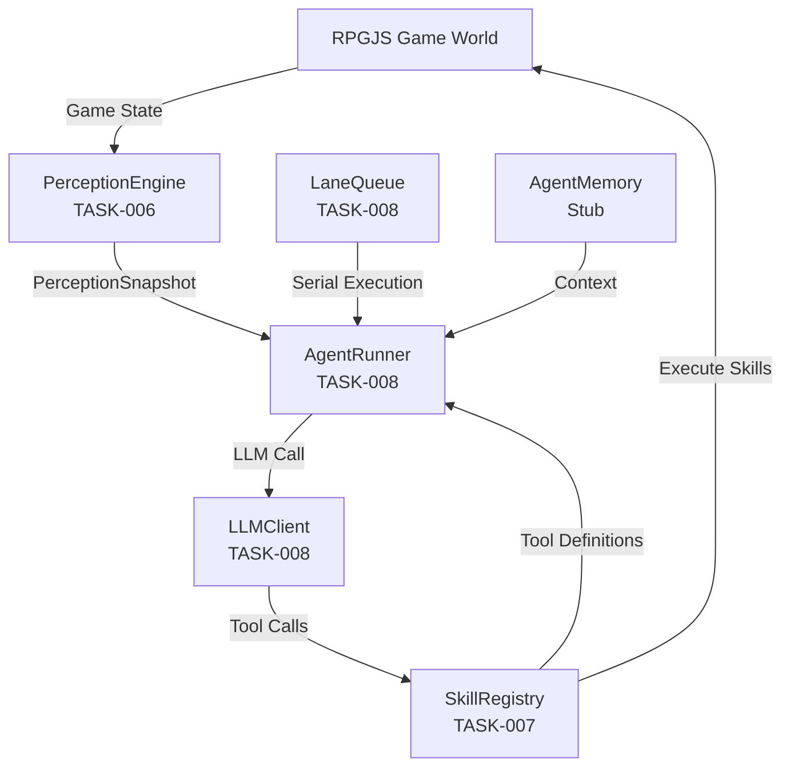
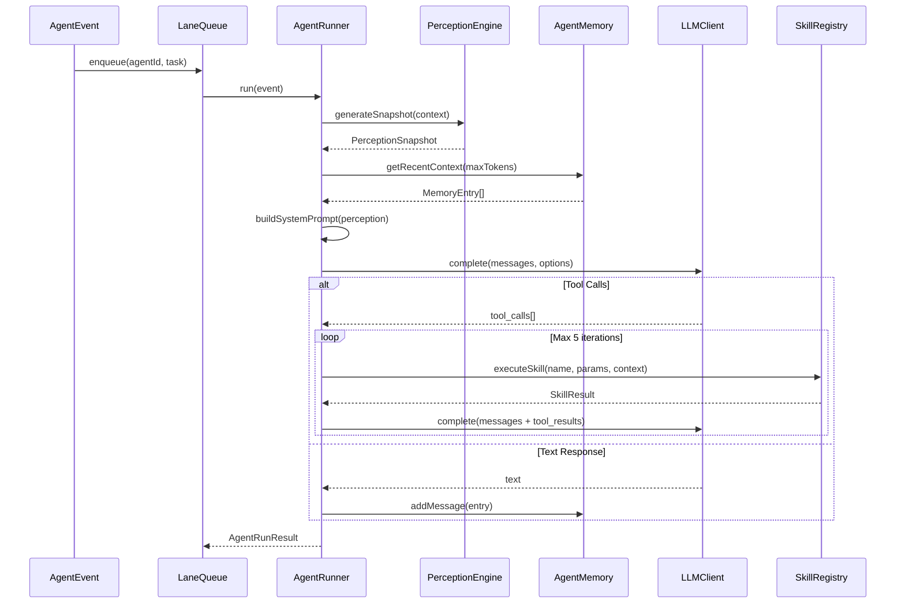
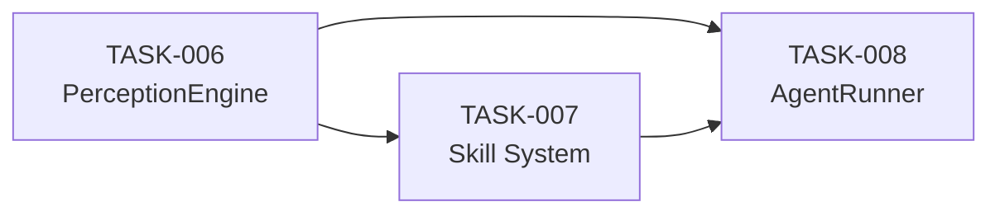

# Phase 3 Core Agent System Sprint Plan

## Sprint Overview

**Objective**: Build the three core components that enable AI NPCs to perceive the game world, execute actions, and reason through LLM integration.**Tasks**: TASK-006 → TASK-007 → TASK-008 (sequential dependencies)**Estimated Effort**: ~1,210 lines of code (TASK-006: ~200 ✅, TASK-007: ~430, TASK-008: ~580), 18-24 hours total**Progress**: 1/3 tasks completed (33%)**Critical Prerequisites**:

- Install `@rpgjs/plugin-emotion-bubbles` before TASK-007
- Update `rpg.toml` to include emotion-bubbles module
- Verify `.env` has `MOONSHOT_API_KEY` or `KIMI_API_KEY`

---

## Architecture Overview



---

## TASK-006: Build PerceptionEngine

**Status**: ✅ COMPLETED (2026-02-11)**Files Created**:

- ✅ `src/agents/perception/PerceptionEngine.ts` (~200 lines) - Complete implementation
- ✅ `src/agents/perception/index.ts` - Module exports

**Implementation Complete**:

- ✅ Distance calculation using `Vector2d.distanceWith()` with pixel-to-tile conversion (default 32px/tile)
- ✅ Direction calculation mapping to 8 cardinal directions (N, NE, E, SE, S, SW, W, NW)
- ✅ Entity processing with distance/direction enrichment, sorting by distance, capping at 5 entities
- ✅ Narrative summary generation in second person perspective
- ✅ Token estimation using 4 chars = 1 token heuristic
- ✅ Token budget enforcement (trims entities from farthest, truncates summary if needed)
- ✅ Main `generateSnapshot()` method orchestrating all steps
- ✅ Module exports for all types and constants

**Verification**:

- ✅ `npm run build` passes
- ✅ `npx tsc --noEmit` passes (only pre-existing upstream errors)
- ✅ No linting errors

**Files to Create** (for reference):**Implementation Details**:

1. **Distance Calculation**:

- Use `Vector2d.distanceWith()` from `@rpgjs/common`
- Convert `Position` objects to `Vector2d` instances
- **Important**: RPGJS positions are in **pixels**, not tiles. `event.position` returns `{x, y}` in pixel coordinates. `Vector2d.distanceWith()` returns pixel distance. For `NearbyEntity.distance` (documented as "distance in tiles"), divide by tile size: `distanceInTiles = pixelDistance / map.tileWidth` (typically 32 pixels per tile)
- Reference: `docs/rpgjs-reference/packages/common/src/Vector2d.ts`

2. **Direction Calculation**:

- Calculate angle using `Math.atan2(dy, dx)`
- Map to 8 cardinal directions: N, NE, E, SE, S, SW, W, NW
- Return as string (e.g., `"north"`, `"southeast"`)

3. **Entity Processing**:

- Filter `rawEntities` from `PerceptionContext`
- Calculate distance for each entity
- Sort by distance (closest first)
- Cap at `MAX_NEARBY_ENTITIES = 5`

4. **Token Budget Enforcement**:

- Heuristic: `1 token ≈ 4 characters`
- Estimate: `summary.length + entities.reduce((sum, e) => sum + JSON.stringify(e).length, 0)`
- If over 300 tokens: trim entities from farthest, then truncate summary

5. **Summary Generation**:

- Format: `"You are in {mapName}. {nearbyDescription}."`
- Example: `"You are in the village square. A player named Alex approaches from the east."`
- Keep to 1-2 sentences, second person perspective

**RPGJS Integration Points**:

- `RpgWorld.getPlayersOfMap(mapId)` - get all players on a map
- `RpgWorld.getObjectsOfMap(mapId)` - get players + events
- `event.position` - NPC's current `{x, y, z}` position
- `map.id` - map identifier string

**Testing**:

- Unit tests with mock `PerceptionContext`
- Verify token budget enforcement (< 300 tokens)
- Test all 8 cardinal directions
- Test edge cases: empty entities, over-budget scenarios

---

## TASK-007: Build Skill System

**Status**: Depends on TASK-006 (for `look` skill integration)**Files to Create**:

- `src/agents/skills/SkillRegistry.ts` (~150 lines)
- `src/agents/skills/skills/move.ts` (~80 lines)
- `src/agents/skills/skills/say.ts` (~60 lines)
- `src/agents/skills/skills/look.ts` (~40 lines)
- `src/agents/skills/skills/emote.ts` (~70 lines)
- `src/agents/skills/skills/wait.ts` (~30 lines)
- `src/agents/skills/index.ts` (exports)

**Critical Issue: ToolDefinition Format Mismatch**The existing `ToolDefinition` interface in `src/agents/skills/types.ts` uses Anthropic's format:

```typescript
interface ToolDefinition {
  name: string
  description: string
  input_schema: { ... }  // ❌ Anthropic format
}
```

But we need OpenAI-compatible format for Kimi K2/K2.5:

```typescript
interface OpenAIToolDefinition {
  type: 'function'
  function: {
    name: string
    description: string
    parameters: { ... }  // ✅ OpenAI format
  }
}
```

**Solution**:

1. Create new `OpenAIToolDefinition` type in `SkillRegistry.ts`
2. **Update `ISkillRegistry` interface in `src/agents/skills/types.ts`**: Change `getToolDefinitions()` return type from `ReadonlyArray<ToolDefinition>` to `ReadonlyArray<OpenAIToolDefinition>`
3. Convert `SkillParameterSchema` → JSON Schema `properties` format
4. Keep `ToolDefinition` for internal reference (or deprecate)

**Note**: Since Cursor owns `src/agents/`, updating the interface is within scope.**Skill Implementations**:

1. **`move` skill**:

- Parameters: `direction: enum('up', 'down', 'left', 'right')`
- Execute: `await context.event.moveRoutes([Move.tileUp()])` (or tileDown/Left/Right)
- Error handling: catch movement failures, return `{ success: false, error: 'blocked' }`
- Reference: `docs/rpgjs-guide.md` - Movement API

2. **`say` skill**:

- Parameters: `message: string`, `target?: string`
- Execute: `await player.showText(message, { talkWith: context.event })`
- Find target: Search by name first (`context.nearbyPlayers.find(p => p.name === target)`), fall back to closest player (`context.nearbyPlayers[0]`)
- **Important**: `showText` is called on the player (not the NPC), and `talkWith: context.event` makes the NPC face the player
- Reference: `main/events/test-npc.ts` - shows `showText` usage

3. **`look` skill**:

- Parameters: none
- Execute: Call `PerceptionEngine.generateSnapshot()` (from TASK-006)
- Return: `perception.summary` text
- **Implementation Note**: `GameContext` doesn't include a `perceptionEngine` reference. Pass `PerceptionEngine` into the `look` skill's constructor (closure pattern) when registering it. This keeps `GameContext` clean and allows the skill to call the perception engine directly.

4. **`emote` skill**:

- Parameters: `action: enum('wave', 'nod', 'shake_head', 'laugh', 'think')`
- Execute: `context.event.showEmotionBubble(EmotionBubble.Happy)` (etc.)
- Emotion mapping:
     ```typescript
                                   const emotionMap = {
                                     'wave': EmotionBubble.Happy,
                                     'nod': EmotionBubble.Exclamation,
                                     'shake_head': EmotionBubble.Cross,
                                     'laugh': EmotionBubble.HaHa,
                                     'think': EmotionBubble.ThreeDot,
                                   }
     ```


- **REQUIRES**: `@rpgjs/plugin-emotion-bubbles` installed
- Reference: `docs/rpgjs-plugin-analysis.md` - emotion bubbles API

5. **`wait` skill**:

- Parameters: `durationMs?: number` (default 2000, max 10000)
- Execute: `await new Promise(resolve => setTimeout(resolve, durationMs))`

**SkillRegistry Implementation**:

- Store skills in `Map<string, IAgentSkill>`
- `register(skill)` - throws if duplicate name
- `get(name)` - returns skill or undefined
- `getAll()` - returns array of all skills
- `getToolDefinitions()` - converts to OpenAI format:
  ```typescript
              {
                type: 'function',
                function: {
                  name: skill.name,
                  description: skill.description,
                  parameters: {
                    type: 'object',
                    properties: convertToJSONSchema(skill.parameters),
                    required: getRequiredParams(skill.parameters)
                  }
                }
              }
  ```


- `executeSkill(name, params, context)` - validates params, calls skill.execute()

**Dependency Action Required**:

```bash
npm install @rpgjs/plugin-emotion-bubbles
```

Update `rpg.toml`:

```toml
modules = [
    './main',
    '@rpgjs/default-gui',
    '@rpgjs/plugin-emotion-bubbles',  # ADD THIS
    '@rpgjs/gamepad'
]
```

**Testing**:

- Unit tests for each skill with mock `GameContext`
- Test `getToolDefinitions()` returns valid OpenAI format
- Test parameter validation
- Test error handling (skills never throw)

---

## TASK-008: Build AgentRunner

**Status**: Depends on both TASK-006 and TASK-007**Files to Create**:

- `src/agents/core/AgentRunner.ts` (~300 lines)
- `src/agents/core/LLMClient.ts` (~150 lines)
- `src/agents/core/LaneQueue.ts` (~50 lines)
- `src/agents/core/index.ts` (exports)
- `src/agents/memory/MemoryStub.ts` (~80 lines) - Minimal `IAgentMemory` implementation with in-memory array for MVP

**LaneQueue Implementation**:

```typescript
class LaneQueue implements ILaneQueue {
  private lanes = new Map<string, Promise<void>>()
  
  async enqueue(agentId: string, task: () => Promise<void>): Promise<void> {
    const current = this.lanes.get(agentId) ?? Promise.resolve()
    const next = current.then(task).catch(err => {
      console.error(`[LaneQueue:${agentId}]`, err)
    })
    this.lanes.set(agentId, next)
    return next
  }
  
  isProcessing(agentId: string): boolean {
    const promise = this.lanes.get(agentId)
    // Check if promise is pending (simplified: check if exists and not resolved)
    return promise !== undefined
  }
  
  getQueueLength(agentId: string): number {
    // MVP: return 0 or 1 (simplified)
    return this.isProcessing(agentId) ? 1 : 0
  }
}
```

Reference: `docs/openclaw-reference/src/process/command-queue.ts` - Promise chain pattern**LLMClient Implementation**:

```typescript
import OpenAI from 'openai'
import 'dotenv/config'

class LLMClient implements ILLMClient {
  private client: OpenAI
  
  constructor() {
    this.client = new OpenAI({
      apiKey: process.env.MOONSHOT_API_KEY || process.env.KIMI_API_KEY,
      baseURL: 'https://api.moonshot.ai/v1',
    })
  }
  
  async complete(
    messages: LLMMessage[],
    options: LLMCompletionOptions
  ): Promise<LLMResponse> {
    // Map LLMMessage[] → OpenAI format
    // Map OpenAIToolDefinition[] → OpenAI tools format
    // Call client.chat.completions.create()
    // Parse response: extract text, tool_calls, usage
    // Map back to LLMResponse
  }
}
```

Reference: `src/agents/core/llm-test.ts` - working Moonshot API call pattern**Model Selection**:

- `idle_tick` → `kimi-k2-0905-chat` (or env `KIMI_IDLE_MODEL`)
- `player_action` / `player_proximity` → `kimi-k2.5` (or env `KIMI_CONVERSATION_MODEL`)

Reference: `docs/openclaw-reference/docs/providers/moonshot.md` - confirmed model IDs**AgentRunner.run() Flow**:



**System Prompt Structure**:

```javascript
[Identity]
{AgentConfig.personality}

[World]
You are in {map.name}. {perception.summary}

[Skills]
You can use these actions:
- move: Move one tile in a direction (up, down, left, right)
- say: Speak to a nearby player
- look: Observe your surroundings
- emote: Express an emotion (wave, nod, shake_head, laugh, think)
- wait: Pause for a moment

[Memory]
{Recent conversation context if any}

[Rules]
- Stay in character at all times
- Keep responses short (<200 characters)
- Don't break the fourth wall
- Use skills to interact with the world

[Current State]
{Serialized perception snapshot JSON}
```

**Tool Call Loop**:

- Max iterations: 5 (prevent infinite loops)
- For each tool call: look up skill → execute → collect result
- Feed all tool results back as `role: "tool"` messages
- Call LLM again with updated messages
- If LLM responds with text (no more tool calls) → done

**Memory Integration**:

- Create `MemoryStub.ts` implementing `IAgentMemory` interface:
- In-memory array of `MemoryEntry` records
- Rolling window (oldest trimmed when `maxMessages` exceeded)
- Simple token estimation for `getRecentContext()`
- JSON file persistence (optional for MVP)
- `memory.addMessage()` after each LLM response
- `memory.getRecentContext(maxTokens)` for prompt building
- Reference: `src/agents/memory/types.ts` - interface definition

**Error Handling**:

- All LLM calls wrapped in try/catch
- Classify errors: `context_overflow`, `rate_limit`, `timeout`, `auth_error`
- On error: log, return failed result, NPC falls back to canned behavior
- Never crash the game server

**Testing**:

- Integration test with mock LLM responses
- Test tool call loop (max iterations enforcement)
- Test model selection based on event type
- Test error handling (never crashes server)

---

## Implementation Order & Dependencies




1. **TASK-006** - ✅ COMPLETED (2026-02-11)
2. **TASK-007** - Ready to start (TASK-006 dependency satisfied)
3. **TASK-008** - Waiting for TASK-007 (TASK-006 dependency satisfied)

---

## Critical Prerequisites

Before starting TASK-007:

1. Install emotion-bubbles plugin: `npm install @rpgjs/plugin-emotion-bubbles`
2. Update `rpg.toml`: Add `'@rpgjs/plugin-emotion-bubbles'` to modules array
3. Verify `.env` has `MOONSHOT_API_KEY` or `KIMI_API_KEY`

---

## Known Issues & Gotchas

1. **ToolDefinition Type Mismatch**: Must convert to OpenAI format in TASK-007
2. **Emotion Bubbles Plugin**: Not installed - required for `emote` skill
3. **Model ID**: Use `kimi-k2-0905-chat` (not `-0711-preview`)
4. **Memory Stub**: TASK-008 needs `MemoryStub.ts` implementing `IAgentMemory` with in-memory array
5. **RPGJS Position Format**: `{x, y, z}` where `z` defaults to 0. **Positions are in pixels, not tiles** - divide by `map.tileWidth` for tile-based distance
6. **Line Estimate**: TASK-008 is closer to ~500 lines total (AgentRunner ~300, LLMClient ~150, LaneQueue ~50, MemoryStub ~80)

---

## Success Criteria

- [x] TASK-006: PerceptionEngine generates valid snapshots < 300 tokens
- [ ] TASK-007: All 5 skills execute correctly, tool definitions in OpenAI format
- [ ] TASK-008: AgentRunner processes events through full LLM loop
- [x] TASK-006: `rpgjs build` passes, `npx tsc --noEmit` passes
- [ ] TASK-007: `rpgjs build` passes, `npx tsc --noEmit` passes
- [ ] TASK-008: `rpgjs build` passes, `npx tsc --noEmit` passes
- [ ] All tasks: Error handling prevents server crashes

---

## References

- **RPGJS APIs**: `docs/rpgjs-reference/`, `docs/rpgjs-guide.md`
- **OpenClaw Patterns**: `docs/openclaw-patterns.md`, `docs/openclaw-reference/`
- **Plugin Analysis**: `docs/rpgjs-plugin-analysis.md`
- **Prior Art**: `docs/prior-art-analysis.md`
- **LLM Test**: `src/agents/core/llm-test.ts`

---

## Review Notes (Claude Code)

**Status**: Approved with minor clarifications**Verified Correct**:

- Vector2d.distanceWith() API confirmed
- RpgWorld.getObjectsOfMap() returns RpgPlayer[] (includes events)
- moveRoutes(), showText(), showEmotionBubble() APIs confirmed
- LaneQueue promise-chain pattern matches OpenClaw
- Model IDs (kimi-k2-0905-chat, kimi-k2.5) confirmed

**Updates Made Based on Review**:

1. **ToolDefinition Interface**: Explicitly note updating `ISkillRegistry.getToolDefinitions()` return type in `types.ts`
2. **say skill**: Clarified robust target lookup (search by name, fallback to closest)

---

## Implementation Progress

### TASK-006: Build PerceptionEngine ✅ COMPLETED (2026-02-11)

**Files Created**:

- `src/agents/perception/PerceptionEngine.ts` (200 lines)
- `src/agents/perception/index.ts` (exports)

**Verification**: ✅ Build and type checking pass