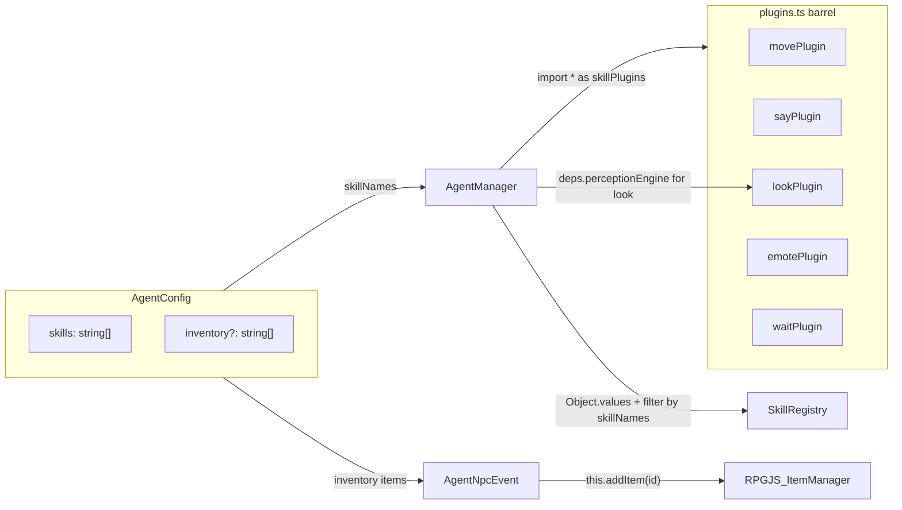

# TASK-018a: Modular Skill Plugin System — Implementation Plan

## Architecture After Implementation




## Phase 1: Plugin Types (~30 lines)

**Create** `src/agents/skills/plugin.ts`:

```typescript
import type { IAgentSkill } from './types'
import type { PerceptionEngine } from '../perception/PerceptionEngine'

export interface SkillDependencies {
  perceptionEngine: PerceptionEngine
}

export interface SkillPlugin {
  name: string
  create: (() => IAgentSkill) | ((deps: SkillDependencies) => IAgentSkill)
  requiredItem?: string
  requiresEnv?: string[]
  category?: 'game' | 'api' | 'social' | 'knowledge'
}
```

## Phase 2: Add skillPlugin to Each Existing Skill

Add a `skillPlugin` export to each file (existing exports stay untouched for backward compat):

- **[src/agents/skills/skills/move.ts](src/agents/skills/skills/move.ts)** — `create: () => moveSkill`, category `'game'`
- **[src/agents/skills/skills/say.ts](src/agents/skills/skills/say.ts)** — `create: () => saySkill`, category `'game'`
- **[src/agents/skills/skills/look.ts](src/agents/skills/skills/look.ts)** — `create: (deps) => createLookSkill(deps.perceptionEngine)`, category `'game'` (only factory-pattern skill)
- **[src/agents/skills/skills/emote.ts](src/agents/skills/skills/emote.ts)** — `create: () => emoteSkill`, category `'game'`
- **[src/agents/skills/skills/wait.ts](src/agents/skills/skills/wait.ts)** — `create: () => waitSkill`, category `'game'`

Each import `SkillPlugin` (and `SkillDependencies` for look) from `'../plugin'`.

## Phase 3: Static Barrel File

**Create** `src/agents/skills/plugins.ts`:

```typescript
export { skillPlugin as movePlugin } from './skills/move'
export { skillPlugin as sayPlugin } from './skills/say'
export { skillPlugin as lookPlugin } from './skills/look'
export { skillPlugin as emotePlugin } from './skills/emote'
export { skillPlugin as waitPlugin } from './skills/wait'
```

Future skills: add one line here. No other core edits needed.

## Phase 4: Replace skillMap in AgentManager

**Modify** [src/agents/core/AgentManager.ts](src/agents/core/AgentManager.ts):

- Replace `import { moveSkill, saySkill, createLookSkill, emoteSkill, waitSkill } from '../skills'` with `import * as skillPlugins from '../skills/plugins'`
- Import `SkillDependencies` from `'../skills/plugin'`
- Replace the entire `registerSkillsFromConfig` function (lines 183-205) with the barrel-driven loop:
  - Build `deps: SkillDependencies = { perceptionEngine: perception }`
  - Loop `Object.values(skillPlugins)`, skip if `!skillNames.includes(plugin.name)`
  - Warn if `plugin.requiresEnv` has missing env vars (but still register)
  - Use `plugin.create.length > 0` to decide factory vs direct call
  - `registry.register(skill)`

## Phase 5: Inventory in AgentConfig

**Modify** [src/agents/core/types.ts](src/agents/core/types.ts) — add to `AgentConfig`:

```typescript
readonly inventory?: ReadonlyArray<string>;
```

**Modify** [src/agents/core/AgentManager.ts](src/agents/core/AgentManager.ts):

- In `parseAgentConfig()` (~line 175): parse `inventory` from YAML, default to `undefined` or `[]`:
  ```typescript
  const inventoryRaw = o.inventory
  const inventory: string[] | undefined = Array.isArray(inventoryRaw)
    ? inventoryRaw.filter((s): s is string => typeof s === 'string')
    : undefined
  ```
  Include `inventory` in the returned `AgentConfig`.
- In `rowToAgentConfig()` (~line 109): no change needed; DB does not have `inventory` column yet (deferred). The `AgentConfig` type has it as optional so `undefined` is fine.

## Phase 6: Grant Items in AgentNpcEvent

**Modify** [main/events/AgentNpcEvent.ts](main/events/AgentNpcEvent.ts) — in `onInit()`, after `this.frequency = 200` and before `instance.contextProvider.getContext = ...`:

```typescript
if (config.inventory && config.inventory.length > 0) {
  for (const itemId of config.inventory) {
    try {
      this.addItem(itemId)
    } catch (err) {
      console.warn(`[AgentNpcEvent] Failed to add item "${itemId}" to ${config.id}:`,
        err instanceof Error ? err.message : String(err))
    }
  }
}
```

`RpgEvent` inherits `addItem(itemClass | string, nb?)` from `ItemManager` mixin, confirmed in RPGJS v4 source.

## Phase 7: ImageGenToken Database Item

**Create directory** `main/database/items/` (does not exist yet).

**Create** `main/database/items/ImageGenToken.ts`:

```typescript
import { Item } from '@rpgjs/database'

@Item({
  id: 'image-gen-token',
  name: 'Mystical Lens',
  description: 'A shimmering lens that allows the bearer to capture visions.',
  price: 0,
  consumable: false,
})
export default class ImageGenToken {}
```

RPGJS autoloads from `main/database/` recursively. No manual registration needed.

## Phase 8: Re-export Plugin Types

**Modify** [src/agents/skills/index.ts](src/agents/skills/index.ts) — add at the bottom:

```typescript
// Plugin system types
export type { SkillPlugin, SkillDependencies } from './plugin'
```

Existing exports (moveSkill, saySkill, etc.) remain untouched.

## Phase 9: Verify

- `rpgjs build` passes
- `npx tsc --noEmit` passes (pre-existing errors only)
- Elder Theron (no inventory, five base skills) behaves identically (regression check)
- Adding a future skill = one file + one barrel line (no core edits)

## Files Summary


| Action | File                                                                  |
| ------ | --------------------------------------------------------------------- |
| Create | `src/agents/skills/plugin.ts`                                         |
| Create | `src/agents/skills/plugins.ts`                                        |
| Create | `main/database/items/ImageGenToken.ts`                                |
| Modify | `src/agents/skills/skills/move.ts` (add skillPlugin export)           |
| Modify | `src/agents/skills/skills/say.ts` (add skillPlugin export)            |
| Modify | `src/agents/skills/skills/look.ts` (add skillPlugin export)           |
| Modify | `src/agents/skills/skills/emote.ts` (add skillPlugin export)          |
| Modify | `src/agents/skills/skills/wait.ts` (add skillPlugin export)           |
| Modify | `src/agents/core/types.ts` (add inventory to AgentConfig)             |
| Modify | `src/agents/core/AgentManager.ts` (replace skillMap, parse inventory) |
| Modify | `main/events/AgentNpcEvent.ts` (grant items in onInit)                |
| Modify | `src/agents/skills/index.ts` (re-export plugin types)                 |


