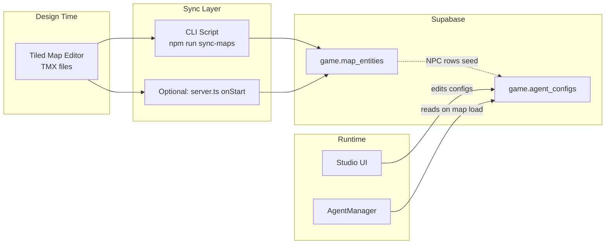

# TMX-to-DB Sync Layer

## Architecture

The sync layer sits between Tiled (map editor) and the database. It does not replace anything -- it feeds initial data into the same tables the game already reads from.




**Key principle:** TMX sync writes *placement and metadata*. Studio writes *AI configuration* (personality, skills, model, behavior). AgentManager reads the merged result at runtime. TMX never overwrites Studio edits.

## Sprint Placement


| Task ID    | Title                                                | Owner                                  | Depends on      | Wave |
| ---------- | ---------------------------------------------------- | -------------------------------------- | --------------- | ---- |
| D-6        | Migration 012: map_entities + map_metadata tables    | Orchestrator (schema review) -> Cursor | D-1             | 1    |
| tmx-enrich | Enrich simplemap.tmx with seed NPCs as named objects | Cursor                                 | --              | 1    |
| G-5        | TMX parser + sync logic + CLI script                 | Cursor                                 | D-6, tmx-enrich | 1    |
| G-6        | Optional auto-sync on server start                   | Cursor                                 | G-5             | 1    |


G-5/G-6 can run **in parallel** with G-0 (Supabase config loading). Foundation verification (PM sign-off) should wait for BOTH G-0 and G-5 so the full pipeline is testable: enrich TMX -> sync to DB -> start game -> AgentManager loads from DB -> NPCs spawn.

## Decision: Seed NPCs in TMX (Adjustment 2)

**Decision: Option (a) -- Add seed NPCs to TMX.**

The 4 existing seed NPCs in `game.agent_configs` (elder-theron, test-agent, photographer, artist) have spawn coordinates in the DB but do NOT exist as named objects in `simplemap.tmx`. Only `EV-1` (an unrelated point) exists in the TMX.

To make Tiled the single source of truth for placement:

- Add `elder-theron`, `test-agent`, `photographer`, `artist` as named `<object>` entries in `simplemap.tmx` with proper custom properties (`entityType="ai-npc"`, `displayName`, `sprite`).
- Position them at their current seed coordinates (elder-theron: 300,250; test-agent: 450,350; photographer: 500,200; artist: 150,400).
- When sync runs, it creates `map_entities` rows and links to existing `agent_configs` rows (which already have personality, skills, etc.).
- Future placement changes happen in Tiled; sync updates `agent_configs.spawn` only.

This is task `tmx-enrich` and must happen before G-5 testing.

## Phase 0: TMX Enrichment (Current State + Test Data)

**Current state of TMX files:**

- `simplemap.tmx` -- 2 objects: `start` (player spawn, skipped) and `EV-1` (bare point at 290,371 with zero custom properties).
- `simplemap2.tmx` -- zero objects.

The sync pipeline needs real data to test. Before G-5 can be verified:

1. Add 4 named NPC objects to `simplemap.tmx` matching seed NPCs. **Coordinates below match migration 009** (photographer 500,200; artist 150,400) so no sync drift.

```xml
<object id="20" name="elder-theron" x="300" y="250">
  <properties>
    <property name="entityType" value="ai-npc"/>
    <property name="displayName" value="Elder Theron"/>
    <property name="sprite" value="female"/>
    <property name="role" value="elder"/>
  </properties>
  <point/>
</object>
<object id="21" name="test-agent" x="450" y="350">
  <properties>
    <property name="entityType" value="ai-npc"/>
    <property name="displayName" value="Test Agent"/>
    <property name="sprite" value="female"/>
  </properties>
  <point/>
</object>
<object id="22" name="photographer" x="500" y="200">
  <properties>
    <property name="entityType" value="ai-npc"/>
    <property name="displayName" value="Photographer"/>
    <property name="sprite" value="female"/>
    <property name="tools" value="generate_image"/>
  </properties>
  <point/>
</object>
<object id="23" name="artist" x="150" y="400">
  <properties>
    <property name="entityType" value="ai-npc"/>
    <property name="displayName" value="Artist"/>
    <property name="sprite" value="female"/>
  </properties>
  <point/>
</object>
```

1. Optionally add a non-NPC object for testing other entity types (e.g. a spawn point or area marker).
2. Update `nextobjectid` in the `<map>` tag to be higher than the highest new object ID.

After this, the sync pipeline has 5+ entities to work with and can be tested end-to-end.

## Phase 1: New `game.map_entities` Table (Migration 012 / Task D-6)

A new table to hold **all** entity types synced from TMX. This is separate from `game.agent_configs` because most entities are not AI agents (they're triggers, areas, spawn-points, objects).

**File:** `supabase/migrations/012_map_entities.sql`

```sql
create table if not exists game.map_entities (
  id            text        not null,      -- TMX object name (e.g. "EV-1", "trig_void_chaos_01")
  map_id        text        not null,      -- derived from TMX filename
  entity_type   text        not null,      -- "ai-npc" | "object" | "trigger" | "area-marker" | "spawn-point"
  display_name  text,                      -- human-readable name
  position_x    real        not null,      -- pixel x from TMX
  position_y    real        not null,      -- pixel y from TMX
  tiled_class   text,                      -- TMX class/type attribute
  role          text,                      -- e.g. "merchant", "sign"
  sprite        text        default 'female',
  ai_enabled    boolean     default false,
  tools         text[]      default '{}',
  area_id       text,                      -- logical area reference
  metadata      jsonb       default '{}',  -- any extra TMX custom properties
  agent_config_id text      references game.agent_configs(id) on delete set null,
  synced_at     timestamptz default now(),
  primary key (id, map_id)
);
```

- Composite PK `(id, map_id)` -- same entity name can exist on different maps.
- `agent_config_id` is a nullable FK to `game.agent_configs` with `ON DELETE SET NULL`. When sync finds an NPC, it can optionally create/link an agent_configs row.
- `synced_at` tracks when this row was last written by the sync script.

**Orphan behavior (Adjustment 4):** Deleting an `agent_configs` row sets `map_entities.agent_config_id` to NULL (the map entity survives). Deleting a `map_entities` row (e.g. entity removed from TMX and re-synced) does NOT cascade to `agent_configs` -- the config row becomes an orphan. This is acceptable: Studio still manages orphaned configs and can delete them manually. Document this in migration comments and docs.

Also add a map-level metadata table:

```sql
create table if not exists game.map_metadata (
  map_id       text  primary key,
  description  text,
  theme        text,
  ambient      text,
  synced_at    timestamptz default now()
);
```

**Grants (Adjustment 5) -- must follow migration 011 pattern:**

```sql
-- map_entities: Studio can browse/edit entity placement; game server has full access
GRANT SELECT ON game.map_entities TO anon;
GRANT SELECT, INSERT, UPDATE, DELETE ON game.map_entities TO authenticated;
GRANT ALL ON game.map_entities TO service_role;

-- map_metadata: same pattern
GRANT SELECT ON game.map_metadata TO anon;
GRANT SELECT, INSERT, UPDATE, DELETE ON game.map_metadata TO authenticated;
GRANT ALL ON game.map_metadata TO service_role;
```

- `anon` = SELECT only (public dashboard/embed, read-only).
- `authenticated` = full CRUD (Studio's auth context).
- `service_role` = ALL (game server + sync script).

Do NOT give `anon` write access. This matches `011_studio_cross_schema_access.sql` exactly.

## Phase 2: TMX Parser Module

**File:** `scripts/sync-maps.ts` (also importable from `src/sync/parseTmx.ts`)

Port and adapt Codecamp's `entitySync.ts`:

- Use `fast-xml-parser` (add as dependency) to parse TMX XML
- Read the world file at `main/worlds/myworld.world` to discover all maps
- For each TMX file, extract:
  - **Map-level properties** (`description`, `theme`, `ambient`) from `<map><properties>`
  - **All named objects** from `<objectgroup>`, skipping `name="start"`
  - For each object: `@_name`, `@_x`, `@_y`, `@_class`/`@_type`, and all `<property>` children

Map TMX custom properties to our schema:


| TMX Source                           | DB Column        |
| ------------------------------------ | ---------------- |
| `@_name`                             | `id`             |
| filename (sans .tmx)                 | `map_id`         |
| `properties.entityType` or inferred  | `entity_type`    |
| `properties.displayName` or name map | `display_name`   |
| `@_x`                                | `position_x`     |
| `@_y`                                | `position_y`     |
| `@_class` / `@_type`                 | `tiled_class`    |
| `properties.role` or `@_type`        | `role`           |
| `properties.sprite`                  | `sprite`         |
| `properties.aiEnabled`               | `ai_enabled`     |
| `properties.tools` (comma-split)     | `tools`          |
| `properties.areaId`                  | `area_id`        |
| remaining properties                 | `metadata` jsonb |


Entity type derivation (same as Codecamp):

- `entityType="spawn-point"` -> `spawn-point`
- `entityType="object-api"` -> `object`
- `entityType="area-marker"` -> `area-marker`
- `entityType="trigger"` -> `trigger`
- has `@_type` attribute or `entityType="ai-npc"` -> `ai-npc`
- default -> `npc`

## Phase 3: Sync Logic (Upsert to Supabase)

The sync function does an **upsert** to `game.map_entities`:

```typescript
async function syncMapEntities(mapId: string, entities: MapEntity[]): Promise<SyncResult> {
  const client = getSupabaseClient()
  // Upsert all entities for this map
  const { error } = await client
    .from('map_entities')
    .upsert(entities, { onConflict: 'id,map_id' })

  // Delete entities that are in DB but NOT in the current TMX parse
  // (entity was removed from the map in Tiled)
  const currentIds = entities.map(e => e.id)
  await client
    .from('map_entities')
    .delete()
    .eq('map_id', mapId)
    .not('id', 'in', `(${currentIds.join(',')})`)
}
```

For `ai-npc` entities: also create a **skeleton** `game.agent_configs` row if one does not already exist, using:

- `id` from the entity name (e.g. `"EV-1"` or a mapped slug)
- `name` from `display_name`
- `graphic` from `sprite`
- `personality` = `''` (empty -- to be filled in Studio)
- `spawn` = `{"map": mapId, "x": position_x, "y": position_y}`
- `enabled` = `false` (requires Studio to enable after configuring personality)

This ensures TMX sync **never** creates a half-configured NPC that would spawn with an empty personality. Studio must explicitly enable it.

**Critical rule:** If an `agent_configs` row already exists for this ID, the sync updates ONLY `spawn.x`, `spawn.y`, `spawn.map` (placement) and `graphic` (sprite). It does NOT touch `personality`, `skills`, `model`, `behavior`, `inventory`, or `enabled`. Studio edits are preserved.

For map metadata: upsert to `game.map_metadata`.

## Phase 4: CLI Script

**File:** `scripts/sync-maps.ts`

```bash
npx tsx scripts/sync-maps.ts           # sync all maps
npx tsx scripts/sync-maps.ts simplemap # sync one map
```

Add to `package.json`:

```json
"sync-maps": "tsx scripts/sync-maps.ts"
```

Output:

```
Syncing maps from main/worlds/myworld.world...
  simplemap: 5 entities (2 npc, 1 trigger, 1 area, 1 spawn-point)
    - Created 3 map_entities rows
    - Updated 2 map_entities rows
    - Created 1 skeleton agent_configs row (disabled, needs Studio config)
  simplemap2: 0 entities
Done. 5 entities synced across 2 maps.
```

Requires: `SUPABASE_URL` and `SUPABASE_SERVICE_ROLE_KEY` in `.env`.

Also add `fast-xml-parser` as a dependency.

## Phase 5: Optional Server-Start Auto-Sync

**File:** `main/server.ts` (modify `onStart`)

```typescript
// In onStart, after existing setup:
if (process.env.SYNC_TMX_ON_START === 'true') {
  syncAllMaps().catch(err =>
    console.error('[TMX-Sync] Non-blocking sync failed:', err.message)
  )
}
```

Disabled by default. Opt-in via env var. Fire-and-forget (non-blocking).

## Phase 6: Studio Integration Points

Studio reads `game.map_entities` to show a map-aware entity browser:

- List all entities per map with their types, positions, and roles
- For `ai-npc` entities, link to the NPC Builder (which edits `game.agent_configs`)
- For triggers/areas/objects, show metadata and allow future configuration
- Map metadata (theme, ambient) shown in a map-level settings panel

This is documentation/spec for Lovable -- no game code needed. The migration + RLS grants make the data accessible to Studio via `.schema('game').from('map_entities')`.

## Phase 7 (Future): Studio Map Creator

The user mentioned wanting a map builder/creator in Studio that syncs maps themselves. This is a larger feature. The foundation this plan provides:

- `game.map_metadata` stores per-map metadata that Studio can read/write
- `game.map_entities` stores all objects per map -- Studio could write new objects here
- A **reverse sync** (DB -> TMX) script could regenerate TMX object layers from DB rows

For a full map creator, the approach would be: Studio edits `map_entities` + `map_metadata` in the DB, then a "publish" action runs a reverse-sync that writes TMX files and triggers a game server reload. This is out of scope for this plan but the schema supports it.

## Files to Create or Modify


| File                                       | Action                                                | Task       | Owner                           |
| ------------------------------------------ | ----------------------------------------------------- | ---------- | ------------------------------- |
| `main/worlds/maps/simplemap.tmx`           | Modify (add 4 seed NPC objects + properties)          | tmx-enrich | Cursor                          |
| `supabase/migrations/012_map_entities.sql` | Create (tables + 011-aligned grants + orphan comment) | D-6        | Orchestrator (review) -> Cursor |
| `src/sync/parseTmx.ts`                     | Create (reusable TMX parser)                          | G-5        | Cursor                          |
| `src/sync/syncMapEntities.ts`              | Create (upsert + skeleton agent_configs)              | G-5        | Cursor                          |
| `scripts/sync-maps.ts`                     | Create (CLI entry point)                              | G-5        | Cursor                          |
| `main/server.ts`                           | Modify (optional auto-sync)                           | G-6        | Cursor                          |
| `package.json`                             | Modify (add `fast-xml-parser`, `sync-maps` script)    | G-5        | Cursor                          |
| `.env.example`                             | Modify (add `SYNC_TMX_ON_START`)                      | G-6        | Cursor                          |
| `docs/supabase-schema.md`                  | Modify (document new tables + orphan behavior)        | docs       | Orchestrator                    |


## Naming Convention for TMX Objects

Adopt a clear convention (document in AGENTS.md and docs):

- `{slug}` -- AI NPCs use their agent_configs ID as the object name (e.g. `elder-theron`, `photographer`)
- `EV-{N}` -- Legacy/numbered NPCs (e.g. `EV-1`) -- still supported but prefer slug IDs
- `obj_{map}_{desc}_{N}` -- Interactive objects (e.g. `obj_village_well_01`)
- `trig_{map}_{desc}_{N}` -- Triggers (e.g. `trig_village_door_01`)
- `area_{map}_{desc}_{N}` -- Area markers (e.g. `area_village_square_01`)
- `spawn_{map}_{desc}_{N}` -- Spawn points (e.g. `spawn_village_start_01`)
- `start` -- Player start point (skipped by sync)

## Orchestrator Review Adjustments (Applied)

This plan incorporates all 5 adjustments from the orchestrator review:

1. **TMX enrichment for testing (Adjustment 1):** Phase 0 added. The current TMX files are nearly empty (simplemap has only `start` + `EV-1` with no properties; simplemap2 has zero objects). Phase 0 adds 4 seed NPC objects with proper custom properties so the sync pipeline is testable.
2. **Seed NPC in TMX decision (Adjustment 2):** Decision (a) adopted -- add seed NPCs to TMX. Documented in "Decision: Seed NPCs in TMX" section above. Tiled becomes the single source of truth for NPC placement.
3. **Task IDs and sprint placement (Adjustment 3):** Tasks D-6, tmx-enrich, G-5, G-6 assigned. Sprint placement table added with wave 1, dependency chain documented.
4. **FK orphan behavior documented (Adjustment 4):** Noted in Phase 1 under the FK bullet: removing an entity from TMX and re-syncing orphans the `agent_configs` row (acceptable; Studio manages). Migration comments should include this.
5. **Grants aligned with migration 011 (Adjustment 5):** Phase 1 grants section updated: anon = SELECT only, authenticated = full CRUD, service_role = ALL. Matches `011_studio_cross_schema_access.sql` pattern exactly. No anon write access.

